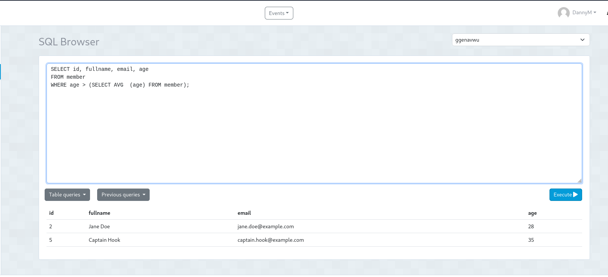
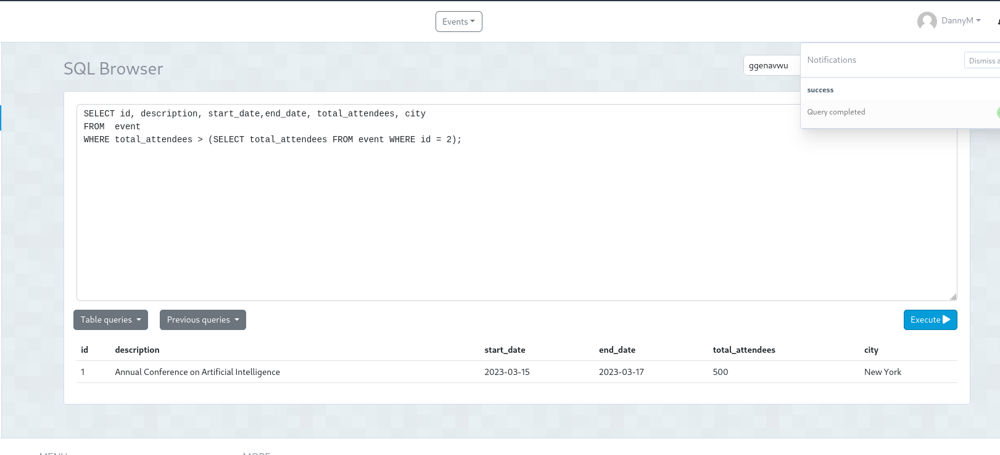

### TAREA EN CLASE
### 

TCS13 - Subconsultas event


### 1. Obtener los miembros cuya edad es mayor que el promedio de las edades de todos los miembros

```
SELECT id, fullname, email, age
FROM member 
WHERE age > (SELECT AVG  (age) FROM member);
```


 
### 2. Obtener los eventos cuyo numero total de asistentes es mayor que el numero total de asistentes a un evento especifico  
```
SELECT id, description, start_date,
FROM  event
WHERE total_attendees > (SELECT total_attendees FROM event WHERE id = 2);
```


